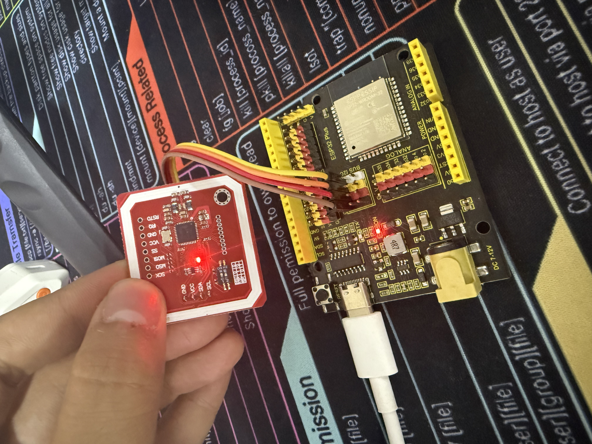
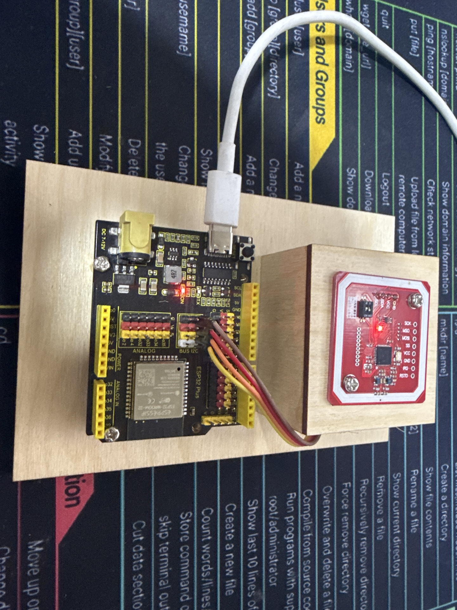
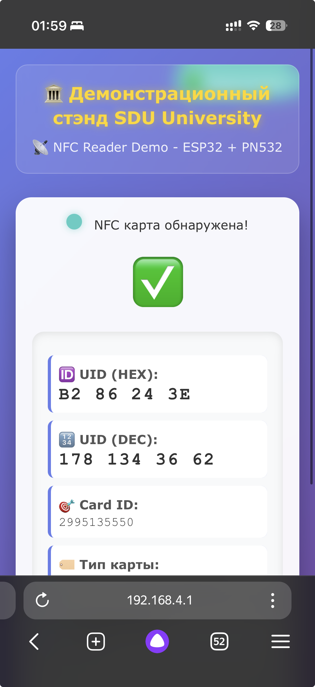
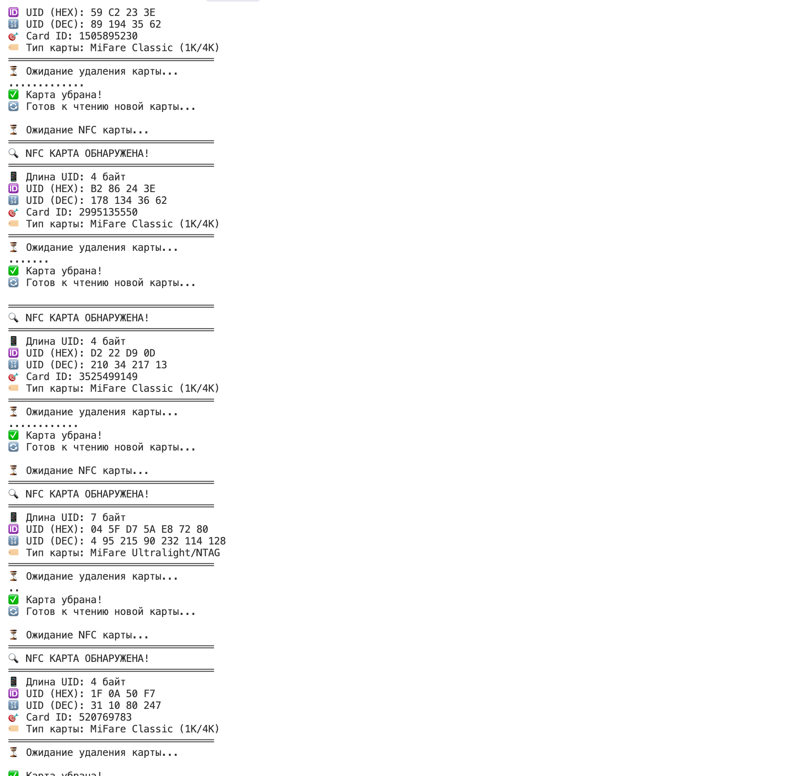

# 🔍 ESP32 NFC Reader с PN532

Проект для чтения UID NFC карт с помощью ESP32 и модуля PN532 по I2C интерфейсу.

## 📋 Описание

Этот проект позволяет:
- ✅ Читать UID любых NFC карт стандарта ISO14443A
- ✅ Определять тип карты (MiFare Classic, Ultralight, NTAG)
- ✅ Выводить UID в HEX и DEC форматах
- ✅ Преобразовывать UID в единый Card ID
- ✅ Корректно обрабатывать смену карт
- ✅ Красивый вывод с эмодзи в Serial Monitor

## 🛠️ Аппаратное обеспечение

### Компоненты:
- **ESP32** (любая плата)
- **PN532 NFC модуль** 
- Соединительные провода
- Макетная плата или корпус для стенда
- Блок питания 5V/3.3V

### 🔌 Схема подключения:



#### Таблица подключений:
```
PN532 Module    →    ESP32
━━━━━━━━━━━━━━━━━━━━━━━━━━━━━
VCC             →    3.3V
GND             →    GND
SDA             →    GPIO 21
SCL             →    GPIO 22
IRQ             →    GPIO 2
RST             →    GPIO 3
```

## 🚀 Установка и запуск

### Требования:
- [PlatformIO](https://platformio.org/) IDE или расширение для VS Code
- ESP32 плата
- PN532 модуль

### Шаги:

1. **Клонирование репозитория:**
   ```bash
   git clone https://github.com/yourusername/DiplomaNFCDemonstrate.git
   cd DiplomaNFCDemonstrate
   ```

2. **Открытие проекта:**
   ```bash
   # В PlatformIO IDE или VS Code
   code .
   ```

3. **Сборка проекта:**
   ```bash
   pio run
   ```

4. **Загрузка на ESP32:**
   ```bash
   pio run --target upload
   ```

5. **Открытие Serial Monitor:**
   ```bash
   pio device monitor --baud 115200
   ```

## 📱 Поддерживаемые карты

- 🎯 **MiFare Classic** (1K/4K)
- 🎯 **MiFare Ultralight**
- 🎯 **NTAG213/215/216**
- 🎯 **Другие карты ISO14443A**

## 💻 Демонстрация работы

### 📷 Фото готового устройства:


### 🌐 Веб-интерфейс:


### 📺 Скриншот терминала:


### 📋 Пример вывода:

```
PN532 NFC Reader - Чтение UID карт
===================================
Найден чип PN532
Версия прошивки: 1.6
Ожидание NFC карты...

═══════════════════════════════════
🔍 NFC КАРТА ОБНАРУЖЕНА!
═══════════════════════════════════
📱 Длина UID: 4 байт
🆔 UID (HEX): A1 B2 C3 D4
🔢 UID (DEC): 161 178 195 212
🎯 Card ID: 2712847316
🏷️  Тип карты: MiFare Classic (1K/4K)
═══════════════════════════════════
⏳ Ожидание удаления карты...
....
✅ Карта убрана!
🔄 Готов к чтению новой карты...
```

## 🔧 Конфигурация

### Настройка пинов (в `src/main.cpp`):
```cpp
#define PN532_IRQ   (2)    // Пин IRQ
#define PN532_RESET (3)    // Пин RST
```

### Настройка I2C (стандартные пины ESP32):
- **SDA:** GPIO 21
- **SCL:** GPIO 22

## 📚 Структура проекта

```
DiplomaNFCDemonstrate/
├── src/
│   └── main.cpp          # Основной код
├── include/
│   └── README            # Заголовочные файлы
├── lib/
│   └── README            # Локальные библиотеки
├── test/
│   └── README            # Тесты
├── platformio.ini        # Конфигурация PlatformIO
├── .gitignore           # Git ignore файл
└── README.md            # Этот файл
```

## 🔍 Поиск и устранение неисправностей

### Проблема: "Модуль PN532 не найден!"
**Решение:** 
- Проверьте подключение проводов
- Убедитесь что PN532 настроен на I2C режим
- Проверьте питание модуля (3.3V)

### Проблема: Карта не читается
**Решение:**
- Приложите карту ближе к антенне
- Убедитесь что карта поддерживает стандарт ISO14443A
- Перезагрузите ESP32

### Проблема: Вторая карта не читается
**Решение:**
- Этот код уже содержит исправления для этой проблемы
- Убедитесь что полностью убираете первую карту
- Дождитесь сообщения "🔄 Готов к чтению новой карты..."

## 📖 Используемые библиотеки

- **Adafruit PN532** - для работы с NFC модулем
- **Wire** - для I2C коммуникации
- **Arduino** - основной фреймворк

## 👤 Автор

Проект создан для дипломной работы по NFC технологиям.

## 📄 Лицензия

Этот проект распространяется под лицензией MIT. См. файл `LICENSE` для подробностей.

## 🤝 Вклад в проект

1. Сделайте Fork проекта
2. Создайте ветку для новой функции (`git checkout -b feature/AmazingFeature`)
3. Зафиксируйте изменения (`git commit -m 'Add some AmazingFeature'`)
4. Отправьте в ветку (`git push origin feature/AmazingFeature`)
5. Откройте Pull Request

## 📞 Поддержка

Если у вас есть вопросы или проблемы, создайте [Issue](https://github.com/yourusername/DiplomaNFCDemonstrate/issues) в репозитории.

---

**🎓 Дипломный проект** | **🔍 NFC Technology** | **⚡ ESP32** | **📡 IoT** 